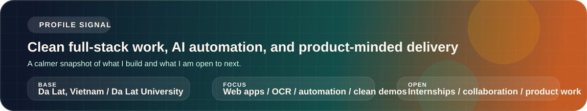
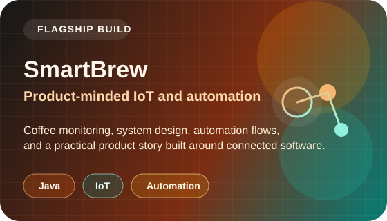
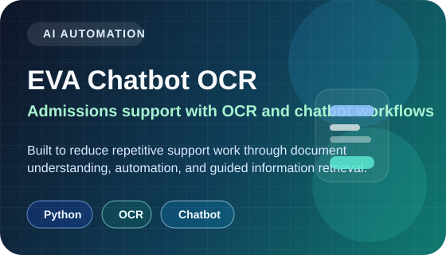
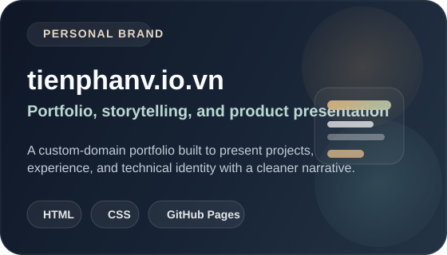

  

  

  <strong>Full-stack developer building useful web products, AI workflows, and automation with a cleaner product mindset.</strong> 
  Da Lat, Vietnam / <a href="https://tienphanv.io.vn">Portfolio</a> / <a href="mailto:2212472@dlu.edu.vn">Email</a>

## Project Spotlight

<table>
  <tr>
    <td width="50%" valign="top">
      
    </td>
    <td width="50%" valign="top">
      
    </td>
  </tr>
  <tr>
    <td colspan="2" valign="top">
      
    </td>
  </tr>
</table>

## Selected Work

- [SmartBrew-CEO-Edition](https://github.com/teddy3704/SmartBrew-CEO-Edition): Java and IoT work shaped like a flagship product demo.
- [EVA_Chatbot_Project_OCR](https://github.com/teddy3704/EVA_Chatbot_Project_OCR): OCR and chatbot automation for practical information workflows.
- [tienphanv.github.io](https://github.com/teddy3704/tienphanv.github.io): Personal portfolio with custom domain and cleaner presentation.
- [Lab2_CNM](https://github.com/teddy3704/Lab2_CNM), [Lab3_CNM](https://github.com/teddy3704/Lab3_CNM), [LAB4_CNM](https://github.com/teddy3704/LAB4_CNM): TypeScript coursework refined into cleaner public repos.

## Current Focus

- Turning coursework into portfolio-grade demos
- Building AI automation and OCR flows for real use cases
- Shipping calmer, cleaner presentation across GitHub and live sites

## Tech

`TypeScript` `Node.js` `Python` `Java` `HTML` `CSS` `GitHub Actions` `GitHub Pages`

## Live GitHub Snapshot

  <picture>
    <source media="(prefers-color-scheme: dark)" srcset="https://github-readme-stats.vercel.app/api?username=teddy3704&show_icons=true&hide_border=true&rank_icon=github&title_color=F0B27A&icon_color=5EEAD4&text_color=E6EDF3&bg_color=00000000" />
    <source media="(prefers-color-scheme: light), (prefers-color-scheme: no-preference)" srcset="https://github-readme-stats.vercel.app/api?username=teddy3704&show_icons=true&hide_border=true&rank_icon=github&title_color=CF6B2D&icon_color=0F766E&text_color=1F2328&bg_color=00000000" />
    
  </picture>
  <picture>
    <source media="(prefers-color-scheme: dark)" srcset="https://github-readme-stats.vercel.app/api/top-langs/?username=teddy3704&layout=compact&langs_count=8&hide_border=true&title_color=F0B27A&text_color=E6EDF3&bg_color=00000000" />
    <source media="(prefers-color-scheme: light), (prefers-color-scheme: no-preference)" srcset="https://github-readme-stats.vercel.app/api/top-langs/?username=teddy3704&layout=compact&langs_count=8&hide_border=true&title_color=CF6B2D&text_color=1F2328&bg_color=00000000" />
    
  </picture>

## Contribution Flow

  <picture>
    <source media="(prefers-color-scheme: dark)" srcset="https://raw.githubusercontent.com/teddy3704/teddy3704/output/github-snake-dark.svg" />
    <source media="(prefers-color-scheme: light), (prefers-color-scheme: no-preference)" srcset="https://raw.githubusercontent.com/teddy3704/teddy3704/output/github-snake.svg" />
    
  </picture>

  Generated automatically with GitHub Actions to keep the profile alive and updated.

## Current Direction

- Turning school and lab work into portfolio-grade engineering stories with stronger demo quality
- Building a GitHub presence that feels like a premium product portfolio, not a default student account
- Doubling down on AI workflows, automation, clean web delivery, and recruiter-friendly presentation

## Connect

- Portfolio: [tienphanv.io.vn](https://tienphanv.io.vn)
- GitHub: [github.com/teddy3704](https://github.com/teddy3704)
- Email: [2212472@dlu.edu.vn](mailto:2212472@dlu.edu.vn)
- Status: Open to internships, collaboration, and product-focused engineering work

If you are interested in collaboration, internships, or product-focused engineering work, feel free to reach out.