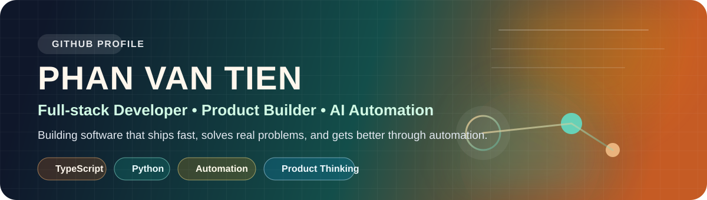

  

  
  
  

  <strong>Building product-grade web apps, AI workflows, and automation that turn real problems into software people can actually use.</strong> 
  Da Lat, Vietnam · Da Lat University · Open to internships, collaboration, and product-focused engineering work

<table>
  <tr>
    <td width="33%" valign="top">
      <strong>Focus</strong> 
      AI automation, OCR workflows, chatbots, and full-stack product builds
    </td>
    <td width="33%" valign="top">
      <strong>Build style</strong> 
      Clear UX, fast iteration, maintainable systems, and practical delivery
    </td>
    <td width="33%" valign="top">
      <strong>Current goal</strong> 
      Turning coursework into polished, portfolio-ready engineering work
    </td>
  </tr>
</table>

## About Me

I am Phan Van Tien, an Information Technology student at Da Lat University who enjoys building useful software for real users.

My work sits at the intersection of full-stack development, AI-assisted workflows, and product thinking:

- building chatbots, OCR flows, and automation that reduce repetitive work
- shipping dashboards, APIs, and websites with clear UX and performance in mind
- approaching engineering with a founder mindset: measurable impact, fast iteration, and maintainable systems

> I like products that solve a real problem, ship quickly, and keep getting better through automation.

## Focus Areas

| Area | What I build |
| --- | --- |
| AI and automation | chatbot workflows, OCR pipelines, data extraction, task automation |
| Full-stack apps | TypeScript interfaces, backend APIs, dashboards, GitHub Pages sites |
| Product engineering | CI/CD, performance tuning, deployment, developer experience |

## Tech Stack

  
  
  
  
  
  
  
  
  
  

## Featured Work

| Project | Summary | Stack |
| --- | --- | --- |
| [EVA_Chatbot_Project_OCR](https://github.com/teddy3704/EVA_Chatbot_Project_OCR) | Admissions-focused chatbot and OCR automation work built around practical school information workflows. | Python, OCR, automation |
| [SmartBrew-CEO-Edition](https://github.com/teddy3704/SmartBrew-CEO-Edition) | Product-oriented experiments for smart coffee monitoring and connected system thinking. | IoT, Java, product design |
| [tienphanv.github.io](https://github.com/teddy3704/tienphanv.github.io) | Personal portfolio site with custom domain, clean storytelling, and performance-minded delivery. | HTML, CSS, GitHub Pages |
| [Lab1_CNM](https://github.com/teddy3704/Lab1_CNM), [Lab2_CNM](https://github.com/teddy3704/Lab2_CNM), [Lab3_CNM](https://github.com/teddy3704/Lab3_CNM), [LAB4_CNM](https://github.com/teddy3704/LAB4_CNM) | Recent TypeScript coursework that shows consistent iteration and shipping discipline. | TypeScript |

## GitHub Snapshot

  <picture>
    <source media="(prefers-color-scheme: dark)" srcset="https://github-readme-stats.vercel.app/api?username=teddy3704&show_icons=true&hide_border=true&rank_icon=github&title_color=F0B27A&icon_color=5EEAD4&text_color=E6EDF3&bg_color=00000000" />
    <source media="(prefers-color-scheme: light), (prefers-color-scheme: no-preference)" srcset="https://github-readme-stats.vercel.app/api?username=teddy3704&show_icons=true&hide_border=true&rank_icon=github&title_color=CF6B2D&icon_color=0F766E&text_color=1F2328&bg_color=00000000" />
    
  </picture>
  <picture>
    <source media="(prefers-color-scheme: dark)" srcset="https://github-readme-stats.vercel.app/api/top-langs/?username=teddy3704&layout=compact&langs_count=8&hide_border=true&title_color=F0B27A&text_color=E6EDF3&bg_color=00000000" />
    <source media="(prefers-color-scheme: light), (prefers-color-scheme: no-preference)" srcset="https://github-readme-stats.vercel.app/api/top-langs/?username=teddy3704&layout=compact&langs_count=8&hide_border=true&title_color=CF6B2D&text_color=1F2328&bg_color=00000000" />
    
  </picture>

## Contribution Flow

  <picture>
    <source media="(prefers-color-scheme: dark)" srcset="https://raw.githubusercontent.com/teddy3704/teddy3704/output/github-snake-dark.svg" />
    <source media="(prefers-color-scheme: light), (prefers-color-scheme: no-preference)" srcset="https://raw.githubusercontent.com/teddy3704/teddy3704/output/github-snake.svg" />
    
  </picture>

  Generated automatically with GitHub Actions to keep the profile alive and updated.

## Current Direction

- Turning coursework into polished, portfolio-ready engineering work
- Building AI and automation features that are useful outside the classroom
- Improving product presentation, deployment quality, and real-world usability

## How I Work

- Start from a real user problem, then choose the simplest stack that can ship it well
- Prefer fast releases, measurable improvements, and a clean feedback loop
- Automate repetitive engineering work early so the product scales with less friction

## Connect

- Portfolio: [tienphanv.io.vn](https://tienphanv.io.vn)
- GitHub: [github.com/teddy3704](https://github.com/teddy3704)
- Email: [2212472@dlu.edu.vn](mailto:2212472@dlu.edu.vn)

If you are interested in collaboration, internships, or product-focused engineering work, feel free to reach out.