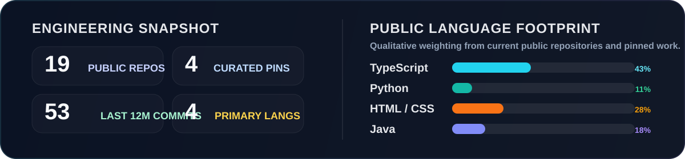
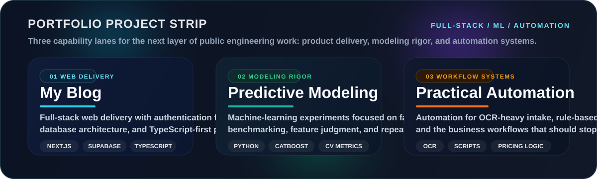

  

  <a href="https://tienphanv.io.vn">Portfolio</a> · <a href="mailto:2212472@dlu.edu.vn">Email</a> · Da Lat, Vietnam · Open to internships and collaboration

> Software engineering student building web delivery, OCR workflows, and practical automation with a product mindset and a steadily higher standard for public engineering quality.

  

  Overview card refreshes daily from live public GitHub data.

## Engineering Focus

- Building cleaner TypeScript-based web work from recent coursework and personal experiments
- Shipping Python workflows around OCR, document handling, and information extraction
- Treating Java projects as opportunities to show architecture, persistence, testing, and packaging discipline
- Turning public repos into a sharper developer brand through clearer docs, naming, and presentation

## Core Toolkit

  
  
  
  
  
  
  
  
  
  
  
  

- **Web delivery:** TypeScript, JavaScript, HTML/CSS, Next.js, GitHub Pages, and repo presentation that is easier to scan and trust
- **Automation and OCR:** Python-first workflows, Tesseract + Poppler document extraction, and workflow tooling that reduces manual steps
- **Product systems:** Supabase, Tailwind CSS, authentication flows, data modeling, and cleaner UI composition for portfolio-grade web work
- **Engineering quality:** Java, Maven, SQLite, tests, static analysis, and product-style packaging rather than one-off demos

## Capability Strip

  

## Selected Work

### <a href="https://github.com/teddy3704/SmartBrew-CEO-Edition">SmartBrew-CEO-Edition</a>

Built a Java ordering system that turns pricing strategies, DAO persistence, SQLite storage, and test tooling into a portfolio-grade desktop product instead of a typical class exercise.

**Stack:** `Java` `Maven` `Swing` `SQLite` `JUnit 5` `JaCoCo` `SpotBugs`

**Highlights:** Strategy-based pricing, packaged runnable build, architecture documentation, and measurable quality tooling.

<a href="https://github.com/teddy3704/SmartBrew-CEO-Edition">Repository</a> · <a href="https://github.com/teddy3704/SmartBrew-CEO-Edition/blob/main/docs/ARCHITECTURE.md">Architecture</a>

### <a href="https://github.com/teddy3704/EVA_Chatbot_Project_OCR">EVA_Chatbot_Project_OCR</a>

Built an OCR-assisted admissions workflow that processes PDFs and images with Tesseract + Poppler and structures the codebase around extraction, retrieval, templates, and automation support.

**Stack:** `Python` `OCR` `Tesseract` `Poppler` `HTML` `CSS` `JavaScript`

**Highlights:** Real document pipeline, chatbot support context, and an automation-oriented project structure.

<a href="https://github.com/teddy3704/EVA_Chatbot_Project_OCR">Repository</a>

### <a href="https://github.com/teddy3704/tienphanv.github.io">tienphanv.github.io</a>

Shipped a custom-domain portfolio site and supporting GitHub presence to make public work feel intentional, polished, and recruiter-friendly on first glance.

**Stack:** `HTML` `CSS` `GitHub Pages`

**Highlights:** Custom domain, brand consistency, and a clearer public narrative around engineering direction.

<a href="https://github.com/teddy3704/tienphanv.github.io">Repository</a> · <a href="https://tienphanv.io.vn">Live Site</a>

## Build Philosophy

> Public repositories should do more than prove that code exists.
>
> They should show ownership, judgment, structure, and the ability to turn raw implementation into something another engineer or recruiter can understand quickly.

## Contribution Trail

  

  Recent public work is concentrated around profile engineering, web delivery, and polishing the repositories that best represent my direction.

